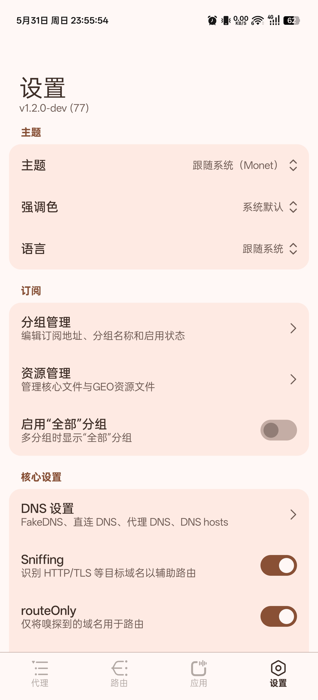

[English](README.md) | 简体中文

# AsteriskNG

一个基于 [Xray-core](https://github.com/XTLS/Xray-core) 的 ROOT Android Xray 客户端。

## Telegram Channel

[Asterisk4Magisk](https://t.me/Asterisk4Magisk)

## 功能

- 使用 Xray-core、iptables 和策略路由的 ROOT TPROXY 透明代理运行时
- 应用代理 Global、Blacklist 和 Whitelist 策略
- VMess、VLESS、Trojan、Shadowsocks、Socks 和 SSH 支持
- v2rayNG、mihomo 订阅格式支持
- 管理 `geoip.dat`、`geosite.dat`、`geoip-only-cn-private.dat` 和 Xray 可执行文件等资源文件
- 通过 Magisk `service.d` 脚本支持 ROOT 开机自启
- MIUIX Compose UI

## 预览

<p align="center">
  
  
  
  
</p>

## TPROXY（ROOT）

- 需要 root 权限。
- 通过 libsu 直接运行本地 Xray 可执行文件。
- 使用 iptables 和策略路由处理透明代理流量。
- 使用已配置的透明代理端口作为 Xray 入站。

## 资源文件

- 运行时文件存储在应用私有的 `files/xray` 目录中，通常为 `/data/user/0/org.asterisk.zcc.ang/files/xray`。
- 内置 Xray 可执行文件会从 native libraries 还原，也可以手动替换为 `xray` 可执行文件，或替换为包含 `xray` 的 zip 压缩包。
- `geoip.dat` 和 `geosite.dat` 可以从内置 assets 还原、从在线来源更新，或手动替换。
- 内置更新来源包括 [Loyalsoldier/v2ray-rules-dat](https://github.com/Loyalsoldier/v2ray-rules-dat)、[v2fly/geoip](https://github.com/v2fly/geoip)、[v2fly/domain-list-community](https://github.com/v2fly/domain-list-community)、[Chocolate4U/Iran-v2ray-rules](https://github.com/Chocolate4U/Iran-v2ray-rules) 和 [runetfreedom/russia-v2ray-rules-dat](https://github.com/runetfreedom/russia-v2ray-rules-dat)。

## 开发

使用 Android Studio 打开项目根目录，或通过 Gradle wrapper 构建：

```powershell
.\gradlew.bat assembleDebug
```

macOS 或 Linux：

```bash
./gradlew assembleDebug
```

构建过程会：

- 使用 Android SDK 和 NDK
- 准备内置 Xray-core 资源
- 构建 native `setuidgid` helper
- 为 `arm64-v8a` 打包 native 运行时组件

如果 Gradle 找不到 Android NDK，请在 `local.properties` 中设置 `ndk.dir`，设置 `ANDROID_NDK_HOME`，或在 Android SDK 下安装 NDK。

## 许可

[GPL-3.0](LICENSE)

## 致谢

- [@XTLS/Xray-core](https://github.com/XTLS/Xray-core)
- [@topjohnwu/libsu](https://github.com/topjohnwu/libsu)
- [@compose-miuix-ui/miuix](https://github.com/compose-miuix-ui/miuix)
- [@2dust/v2rayNG](https://github.com/2dust/v2rayNG)
- [@Loyalsoldier/v2ray-rules-dat](https://github.com/Loyalsoldier/v2ray-rules-dat)
- [@v2fly/geoip](https://github.com/v2fly/geoip)
- [@v2fly/domain-list-community](https://github.com/v2fly/domain-list-community)
- [@Chocolate4U/Iran-v2ray-rules](https://github.com/Chocolate4U/Iran-v2ray-rules)
- [@runetfreedom/russia-v2ray-rules-dat](https://github.com/runetfreedom/russia-v2ray-rules-dat)
